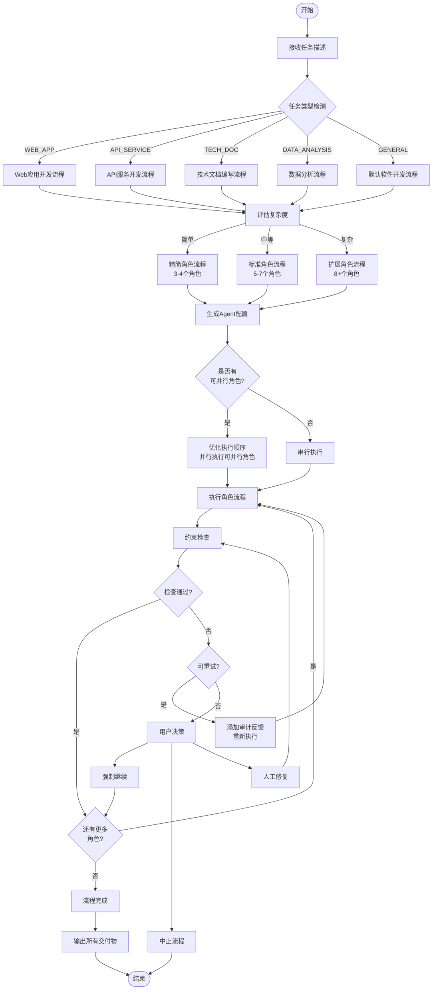
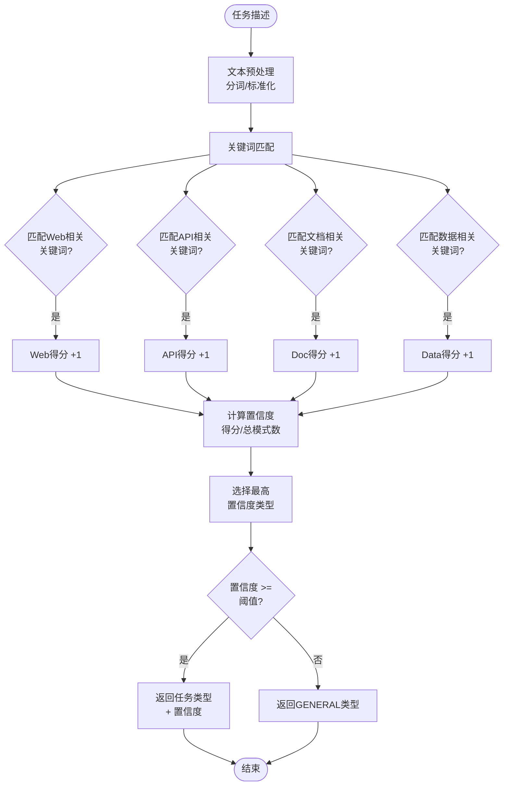
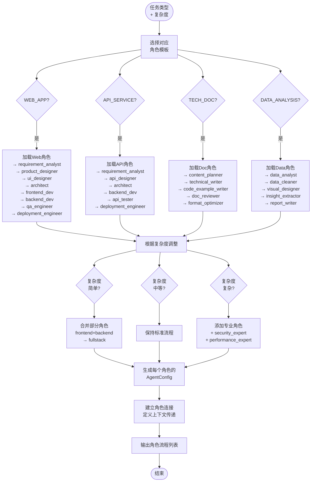
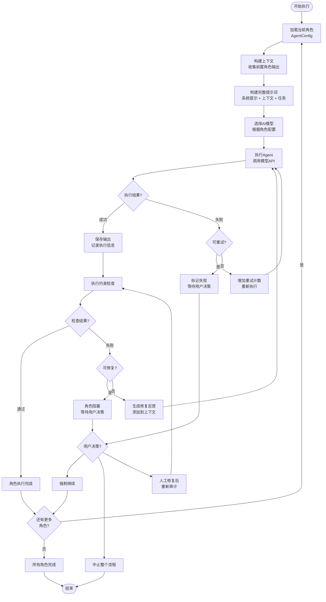
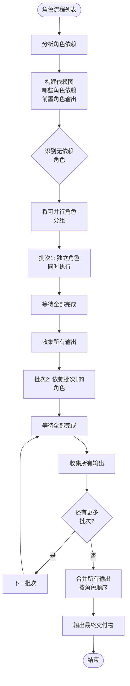
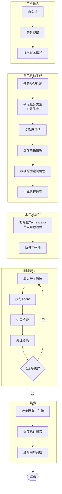
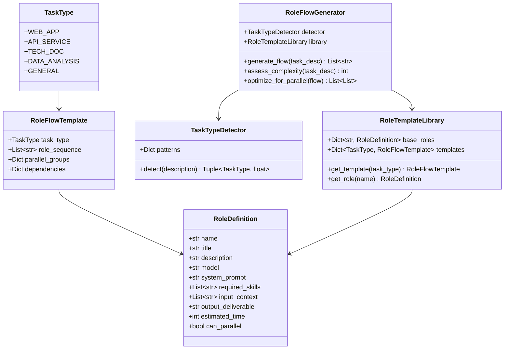
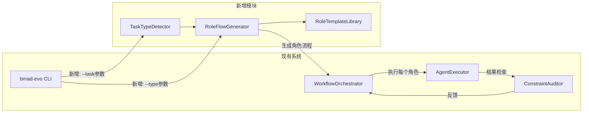

# BMAD-EVO 角色自动生成模块 - 流程图

## 1. 主流程图

---

## 2. 任务类型检测流程

---

## 3. 角色流程生成流程

---

## 4. 角色执行流程

---

## 5. 并行执行优化流程

---

## 6. 完整系统集成流程

---

## 7. 角色模板数据结构

---

## 8. 与现有系统集成

---

*流程图版本：v1.0*
*日期：2026-03-21*
